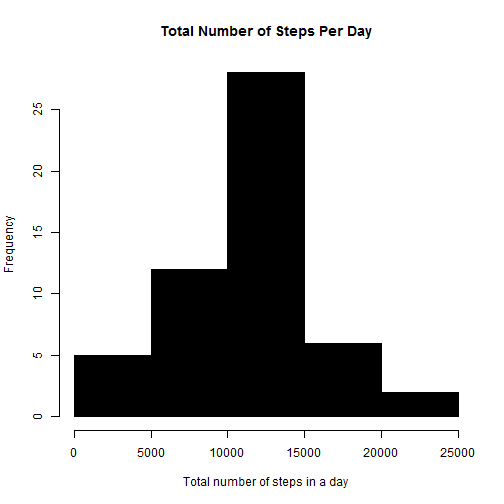
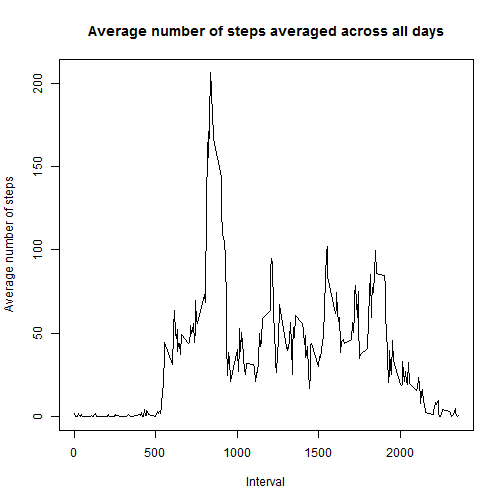
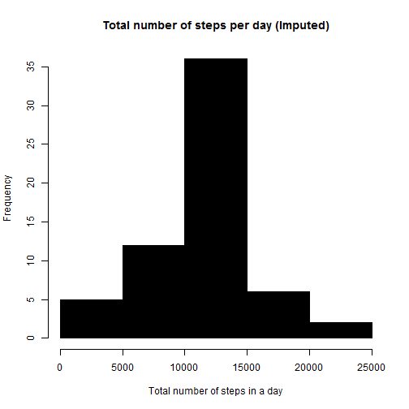

# Reproducible Research - Peer Assessment 1
## Loading and preprocessing the data


```r
opts_chunk$set(cache=TRUE)
```

```r
  require(knitr)
  fileurl <- "http://d396qusza40orc.cloudfront.net/repdata%2Fdata%2Factivity.zip"
  td = tempdir() # Temporary folder
  tf = tempfile(tmpdir=td, fileext=".zip") # placeholder file
  download.file(fileurl, tf)  # Download file
  fname = unzip(tf, list=TRUE)$Name[1] # Get name of csv file 
  unzip(tf, files=fname, exdir=td, overwrite=TRUE) # Unzip file 
  fpath = file.path(td, fname) # Path
  activity <- read.csv(fpath, as.is=TRUE) # Read CSV file
```

## What is mean total number of steps taken per day?

```r
    activity2 <-na.omit(activity)  # Include only complete cases
    steps <- aggregate(steps ~ date, activity2, sum) # Summarize total number of steps by day
```

```r
hist(steps$steps, col=1, main="Total Number of Steps Per Day", 
     xlab="Total number of steps in a day") # Histogram
```

 
*Mean and median total number of steps per day*

```r
mean(steps$steps)
```

```
## [1] 10766
```

```r
median(steps$steps)
```

```
## [1] 10765
```
*The mean and median total number of steps per day are 10766 and 10765 steps respectively*

## What is the average daily activity pattern?


```r
  stepst <- aggregate(steps ~ interval, activity2, mean) # Average number of steps in intervalsacross all days
```

```r
  plot(stepst$interval, stepst$steps, type='l', col=1, 
     main="Average number of steps averaged across all days", xlab="Interval", 
     ylab="Average number of steps")
```

 

```r
# find row id of maximum average number of steps in an interval
max_ave_steps_row_id <- which.max(stepst$steps) # What is the id for maximum number of steps

stepst [max_ave_steps_row_id, ] # What is the range of steps for the above id
```

```
##     interval steps
## 104      835 206.2
```
*The maximum average number of steps correspond to interval 835 with 206.2 steps*

## Imputing missing values


```r
activity_NA <- activity[!complete.cases(activity),] # Subset of observations with missing values 
nrow(activity_NA) # Number of observations
```

```
## [1] 2304
```

```r
#### There are 2,304 observations (rows) with missing values 
  
  activitynomv <-na.omit(activity) 
  stepst <- aggregate(steps ~ interval, activitynomv , mean) # Median number of steps in intervalsacross all days
  activity_imputed <- activity # Create a new dataset to fill with imputed values
  # perform the imputation
  for (i in 1:nrow(activity_imputed)){
    if (is.na( activity_imputed$steps[i])){
      interval_val <-  activity_imputed$interval[i]
      row_id <- which(stepst$interval == interval_val)
      steps_val <- stepst$steps[row_id]
       activity_imputed$steps[i] <- steps_val
    }
  }

activity_NA <- activity[!complete.cases( activity_imputed),] # Subset of observations with missing values 
nrow(activity_NA) # Number of observations
```

```
## [1] 0
```
*This data set does not contain missing values*


```r
# aggregate steps as per date to get total number of steps in a day
steps_imputed <- aggregate(steps ~ date, activity_imputed, sum)
```

```r
# create histogram of total number of steps in a day
hist(steps_imputed$steps, col=1, main="Total number of steps per day (Imputed)", xlab="Total number of steps in a day")
```

 

```r
# Mean and Median for data with imputed values
mean(steps_imputed$steps)
```

```
## [1] 10766
```

```r
median(steps_imputed$steps)
```

```
## [1] 10766
```

```r
# Mean and Median for data with missing values removed 
mean(steps$steps)
```

```
## [1] 10766
```

```r
median(steps$steps)
```

```
## [1] 10765
```
*After replacing missing values with median values, we observe that the median value did not vary between the two data sets. However, the median value with replaced values is higher as more observations are taking into account*

## Are there differences in activity patterns between weekdays and weekends?


```r
activity$date <- as.Date(activity$date, "%Y-%m-%d") # Date class
activity$day <- weekdays(activity$date) # Day of the week
activity$day_type <- c(2) # New column called day type and initialize to weekday

# Replace day_type as weekend if saturday or sunday
for (i in 1:nrow(activity)){
  if (activity$day[i] == "Saturday" || activity$day[i] == "Sunday"){
    activity$day_type[i] <- c(1)
  }
}

activity$day_type <- factor(activity$day_type, levels = c(1,2),
labels = c("Weekend", "Weekdays")) 

# Average number of steps in an interval across all days
activity_imputed <- aggregate(steps ~ interval+day_type, activity, mean)
```

```r
library(lattice)
xyplot(steps ~ interval | day_type, index.cond=list(c(2,1)), data=activity_imputed, type="l", lty = 1, ylab="Number of steps",
       xlab="Intervals",
       main="Average Number of Steps in an Interval Across all Days",
       layout=(c(1,2)))
```

 
